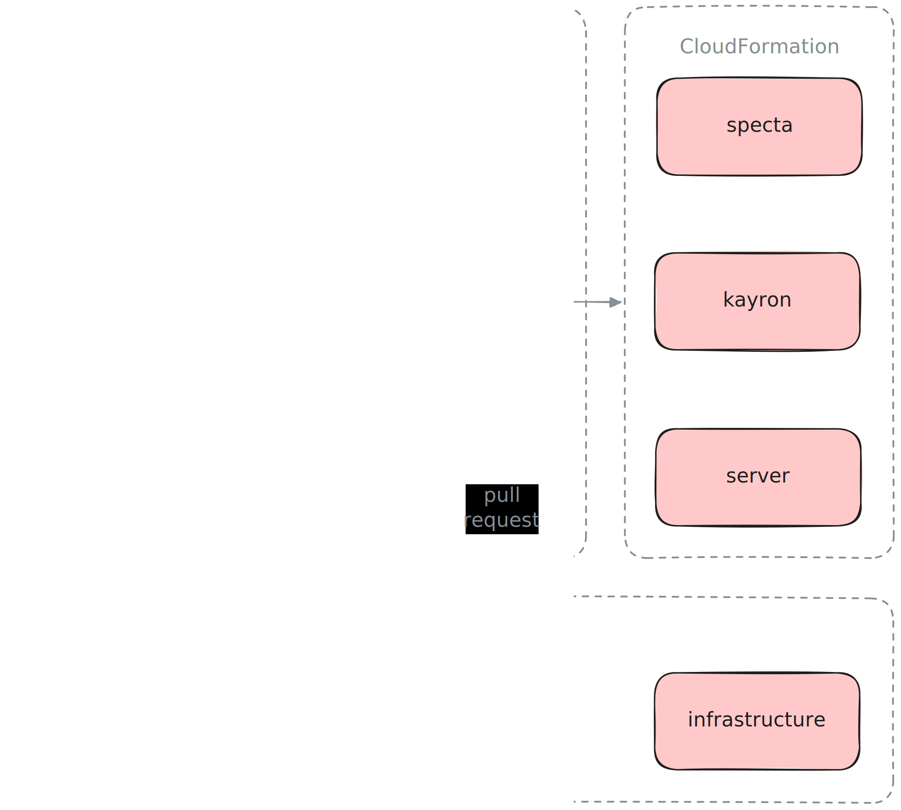
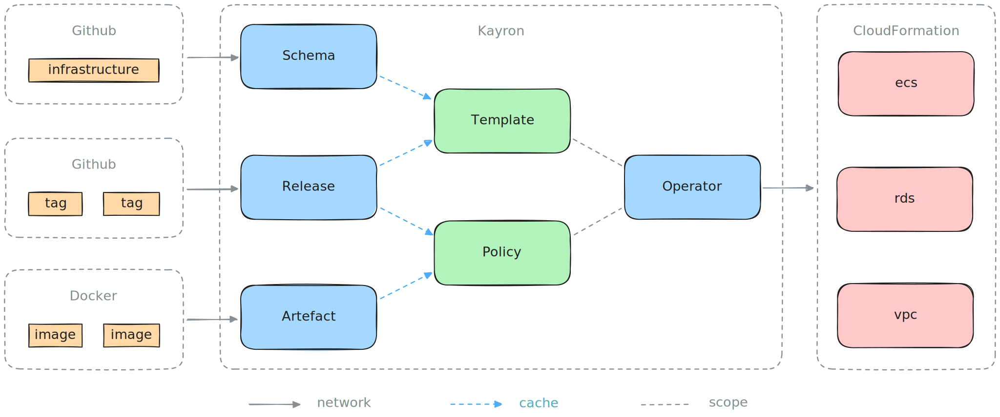

# kayron

This repository contains the operator responsible for our automated change
management. The relevant components here are described by the `server` and
`operator` packages. Kayron's sole responsibility is to keep our infrastructure
and services up to date, according to our [release artifacts] managed in Github.



### Server

The server is a simple HTTP backend exposing the Kayron's `/metrics` endopoint.

```
curl -s http://127.0.0.1:7777/metrics
```

```
# HELP go_gc_duration_seconds A summary of the wall-time pause (stop-the-world) duration in garbage collection cycles.
# TYPE go_gc_duration_seconds summary
go_gc_duration_seconds{quantile="0"} 0
go_gc_duration_seconds{quantile="0.25"} 0
go_gc_duration_seconds{quantile="0.5"} 0
```

### Worker

The worker is a [custom task engine] executing a directed acyclic graph of
worker handlers iteratively. New worker handlers can be added easily by
implementing the handler interface and registering the new handler in the
operator chain. Kayron's operator chain is executed by a sequential worker
engine.

```
type Interface interface {
	// Ensure executes the handler specific business logic in order to complete
	// the given task, if possible. Any error returned will be emitted using the
	// underlying logger interface. Calling this method will not interfere with
	// the execution of other handlers.
	Ensure() error
}
```

### Operator

Kayron is a change management controller implementing the [operator pattern], in
this particular case without the involvement of [Kubernetes]. The main goroutine
for the operator's reconciliation loop is the operator worker handler running a
sequence of steps according to their operator functions located in
[pkg/operator](./pkg/operator/). Secondary worker handlers may be executed
within their own isolated failure domain.

Operators try to continuously drive the current state of a system towards the
desired state of a system. In our case, the current state is represented by the
already deployed CloudFormation templates in AWS. The desired state is then
represented by the template changes introduced in any given environment. Those
changes my simply be a version change from `v1.8.2` to `v1.8.3` in case of a
service update, or a more complex CloudFormation template change that modifies
physical resources in AWS. Kayron’s job is to continuously check for any
detectable drift between current and desired state, and apply any changes made
upon detection.

For instance, if a new Release were to be created in the
[Specta](https://github.com/0xSplits/specta) repository, then Kayron will
generate all CloudFormation templates anew using the changed resource details in
the underlying cache channels, and reconcile the resulting CloudFormation
templates against AWS, if the specified policies permit the proposed update.
This process will then eventually result in a stack update in CloudFormation, so
that Kayron may also keep the respective deployment status up to date in Github.



### Usage

At its core, Kayron is a simple [Cobra] command line tool, providing e.g. the
daemon command to start the long running `server` and `worker` processes.

```
kayron -h
```

```
Golang based operator microservice.

Usage:
  kayron [flags]
  kayron [command]

Available Commands:
  daemon      Execute Kayron's long running process for running the operator.
  deploy      Manually trigger a CloudFormation stack update.
  lint        Validate the release configuration under the given path.
  version     Print the version information for this command line tool.

Flags:
  -h, --help   help for kayron

Use "kayron [command] --help" for more information about a command.
```

### Development

As a convention, Kayron's `.env` file should remain simple and generic. A
reasonable setting within that config file is e.g. `KAYRON_LOG_LEVEL`. Kayron
requires the standard AWS credentials format to be properly setup. More specific
organization and environment related settings must be provided separately. And
so running e.g. the Kayron daemon requires several additional environment
variables to be injected.

- `KAYRON_CLOUDFORMATION_STACK`, the CloudFormation stack name to reconcile, e.g. `server-test`.
- `KAYRON_ENVIRONMENT`, the environment Kayron is running in, one of `development` `testing` `staging` `production`.
- `KAYRON_GITHUB_TOKEN`, the Github token to use for fetching releases, requires the `repo` scope.
- `KAYRON_RELEASE_SOURCE`, the Github repository containing releases, e.g. https://github.com/0xSplits/releases.
- `KAYRON_S3_BUCKET`, the S3 bucket to upload CloudFormation templates, e.g. `splits-cf-templates`.

---

- `KAYRON_CLOUDFORMATION_PARAMETERS`, the optional CloudFormation parameter overwrites, in the format `key:value,foo:bar`.
- `KAYRON_CLOUDFORMATION_TAGS`, the optional CloudFormation tag overwrites, in the format `key:value,foo:bar`.

```
kayron daemon
```

```
{ "time":"2025-07-04 14:09:06", "level":"info", "message":"daemon is launching procs", "environment":"development", "caller":".../pkg/daemon/daemon.go:38" }
{ "time":"2025-07-04 14:09:06", "level":"info", "message":"server is accepting calls", "address":"127.0.0.1:7777",  "caller":".../pkg/server/server.go:95" }
{ "time":"2025-07-04 14:09:06", "level":"info", "message":"worker is executing tasks", "pipelines":"1",             "caller":".../pkg/worker/worker.go:110" }
```

There is an [integration-test](.github/workflows/integration-test.yaml) workflow
to verify several aspects of Kayron's various responsibilities. The test
verifies that all operator functions are free from race conditions, which is
critical, because several operator functions are running in parallel each and
every reconciliation loop. The test also verifies that the operator's
reconciliation loops are not unexpectedly cancelled due to internal data
inconsistencies when looking all kinds of current and desired state for the
internal artifact cache. The required AWS credentials need the
[ViewOnlyAccess], [AmazonEC2ContainerRegistryReadOnly] and
[ResourceGroupsandTagEditorReadOnlyAccess] permissions. The required Github auth
token needs the repository scope.

```
go test -tags=integration ./pkg/operator -v -race -run Test_Operator_Integration
```

```json
=== RUN   Test_Operator_Integration
{
    "time": "2025-08-21 18:19:32",
    "level": "debug",
    "message": "resetting operator cache",
    "caller": "/Users/xh3b4sd/project/0xSplits/kayron/pkg/cache/delete.go:9"
}
{
    "time": "2025-08-21 18:19:34",
    "level": "debug",
    "message": "resolved ref for github repository",
    "environment": "testing",
    "ref": "2fd5cb440fe5e6b9ff205ea94c07a77a331fc79e",
    "repository": "https://github.com/0xSplits/releases",
    "caller": "/Users/xh3b4sd/project/0xSplits/kayron/pkg/operator/release/ensure.go:65"
}
{
    "time": "2025-08-21 18:19:35",
    "level": "debug",
    "message": "caching release artifact",
    "deploy": "v0.1.5",
    "github": "infrastructure",
    "provider": "cloudformation",
    "caller": "/Users/xh3b4sd/project/0xSplits/kayron/pkg/cache/create.go:17"
}
{
    "time": "2025-08-21 18:19:35",
    "level": "debug",
    "message": "caching release artifact",
    "deploy": "v0.1.9",
    "docker": "kayron",
    "github": "kayron",
    "caller": "/Users/xh3b4sd/project/0xSplits/kayron/pkg/cache/create.go:17"
}
{
    "time": "2025-08-21 18:19:35",
    "level": "debug",
    "message": "caching release artifact",
    "deploy": "v0.1.18",
    "docker": "specta",
    "github": "specta",
    "caller": "/Users/xh3b4sd/project/0xSplits/kayron/pkg/cache/create.go:17"
}
{
    "time": "2025-08-21 18:19:35",
    "level": "debug",
    "message": "instrumented worker handler",
    "handler": "release",
    "latency": "2.2552785s",
    "success": "true",
    "caller": "/Users/xh3b4sd/project/0xSplits/workit/handler/metrics/ensure.go:55"
}
{
    "time": "2025-08-21 18:19:35",
    "level": "debug",
    "message": "caching desired state",
    "desired": "v0.1.18",
    "github": "specta",
    "caller": "/Users/xh3b4sd/project/0xSplits/kayron/pkg/operator/reference/ensure.go:35"
}
{
    "time": "2025-08-21 18:19:35",
    "level": "debug",
    "message": "caching desired state",
    "desired": "v0.1.9",
    "github": "kayron",
    "caller": "/Users/xh3b4sd/project/0xSplits/kayron/pkg/operator/reference/ensure.go:35"
}
{
    "time": "2025-08-21 18:19:35",
    "level": "debug",
    "message": "caching desired state",
    "desired": "v0.1.5",
    "github": "infrastructure",
    "caller": "/Users/xh3b4sd/project/0xSplits/kayron/pkg/operator/reference/ensure.go:35"
}
{
    "time": "2025-08-21 18:19:35",
    "level": "debug",
    "message": "caching current state",
    "current": "v0.1.5",
    "github": "infrastructure",
    "caller": "/Users/xh3b4sd/project/0xSplits/kayron/pkg/operator/template/ensure.go:35"
}
{
    "time": "2025-08-21 18:19:35",
    "level": "debug",
    "message": "instrumented worker handler",
    "handler": "reference",
    "latency": "494.083µs",
    "success": "true",
    "caller": "/Users/xh3b4sd/project/0xSplits/workit/handler/metrics/ensure.go:55"
}
{
    "time": "2025-08-21 18:19:35",
    "level": "debug",
    "message": "instrumented worker handler",
    "handler": "template",
    "latency": "741.125µs",
    "success": "true",
    "caller": "/Users/xh3b4sd/project/0xSplits/workit/handler/metrics/ensure.go:55"
}
{
    "time": "2025-08-21 18:19:37",
    "level": "debug",
    "message": "caching current state",
    "current": "v0.1.9",
    "docker": "kayron",
    "caller": "/Users/xh3b4sd/project/0xSplits/kayron/pkg/operator/container/cache.go:10"
}
{
    "time": "2025-08-21 18:19:37",
    "level": "debug",
    "message": "caching current state",
    "current": "v0.1.18",
    "docker": "specta",
    "caller": "/Users/xh3b4sd/project/0xSplits/kayron/pkg/operator/container/cache.go:10"
}
{
    "time": "2025-08-21 18:19:37",
    "level": "debug",
    "message": "instrumented worker handler",
    "handler": "container",
    "latency": "2.0316385s",
    "success": "true",
    "caller": "/Users/xh3b4sd/project/0xSplits/workit/handler/metrics/ensure.go:55"
}
{
    "time": "2025-08-21 18:19:37",
    "level": "debug",
    "message": "instrumented worker handler",
    "handler": "registry",
    "latency": "55.416µs",
    "success": "true",
    "caller": "/Users/xh3b4sd/project/0xSplits/workit/handler/metrics/ensure.go:55"
}
{
    "time": "2025-08-21 18:19:37",
    "level": "info",
    "message": "continuing reconciliation loop",
    "reason": "detected state drift",
    "caller": "/Users/xh3b4sd/project/0xSplits/kayron/pkg/operator/policy/ensure.go:47"
}
{
    "time": "2025-08-21 18:19:37",
    "level": "debug",
    "message": "instrumented worker handler",
    "handler": "policy",
    "latency": "112.334µs",
    "success": "true",
    "caller": "/Users/xh3b4sd/project/0xSplits/workit/handler/metrics/ensure.go:55"
}
{
    "time": "2025-08-21 18:19:37",
    "level": "debug",
    "message": "resolved ref for github repository",
    "environment": "testing",
    "ref": "v0.1.5",
    "repository": "https://github.com/0xSplits/infrastructure",
    "caller": "/Users/xh3b4sd/project/0xSplits/kayron/pkg/operator/infrastructure/ensure.go:22"
}
{
    "time": "2025-08-21 18:19:37",
    "level": "debug",
    "message": "uploading cloudformation template",
    "bucket": "splits-cf-templates",
    "key": "testing/deployment/deployment.yaml",
    "caller": "/Users/xh3b4sd/project/0xSplits/kayron/pkg/operator/infrastructure/aws.go:26"
}
{
    "time": "2025-08-21 18:19:38",
    "level": "debug",
    "message": "uploading cloudformation template",
    "bucket": "splits-cf-templates",
    "key": "testing/discovery/discovery.yaml",
    "caller": "/Users/xh3b4sd/project/0xSplits/kayron/pkg/operator/infrastructure/aws.go:26"
}
{
    "time": "2025-08-21 18:19:38",
    "level": "debug",
    "message": "uploading cloudformation template",
    "bucket": "splits-cf-templates",
    "key": "testing/elasticache/elasticache.yaml",
    "caller": "/Users/xh3b4sd/project/0xSplits/kayron/pkg/operator/infrastructure/aws.go:26"
}
{
    "time": "2025-08-21 18:19:38",
    "level": "debug",
    "message": "uploading cloudformation template",
    "bucket": "splits-cf-templates",
    "key": "testing/fargate/fargate.yaml",
    "caller": "/Users/xh3b4sd/project/0xSplits/kayron/pkg/operator/infrastructure/aws.go:26"
}
{
    "time": "2025-08-21 18:19:38",
    "level": "debug",
    "message": "uploading cloudformation template",
    "bucket": "splits-cf-templates",
    "key": "testing/index.yaml",
    "caller": "/Users/xh3b4sd/project/0xSplits/kayron/pkg/operator/infrastructure/aws.go:26"
}
{
    "time": "2025-08-21 18:19:39",
    "level": "debug",
    "message": "uploading cloudformation template",
    "bucket": "splits-cf-templates",
    "key": "testing/kayron/kayron.yaml",
    "caller": "/Users/xh3b4sd/project/0xSplits/kayron/pkg/operator/infrastructure/aws.go:26"
}
{
    "time": "2025-08-21 18:19:39",
    "level": "debug",
    "message": "uploading cloudformation template",
    "bucket": "splits-cf-templates",
    "key": "testing/rds/rds.alarms.yaml",
    "caller": "/Users/xh3b4sd/project/0xSplits/kayron/pkg/operator/infrastructure/aws.go:26"
}
{
    "time": "2025-08-21 18:19:39",
    "level": "debug",
    "message": "uploading cloudformation template",
    "bucket": "splits-cf-templates",
    "key": "testing/rds/rds.yaml",
    "caller": "/Users/xh3b4sd/project/0xSplits/kayron/pkg/operator/infrastructure/aws.go:26"
}
{
    "time": "2025-08-21 18:19:40",
    "level": "debug",
    "message": "uploading cloudformation template",
    "bucket": "splits-cf-templates",
    "key": "testing/server/server.yaml",
    "caller": "/Users/xh3b4sd/project/0xSplits/kayron/pkg/operator/infrastructure/aws.go:26"
}
{
    "time": "2025-08-21 18:19:40",
    "level": "debug",
    "message": "uploading cloudformation template",
    "bucket": "splits-cf-templates",
    "key": "testing/specta/specta.yaml",
    "caller": "/Users/xh3b4sd/project/0xSplits/kayron/pkg/operator/infrastructure/aws.go:26"
}
{
    "time": "2025-08-21 18:19:40",
    "level": "debug",
    "message": "uploading cloudformation template",
    "bucket": "splits-cf-templates",
    "key": "testing/telemetry/telemetry.yaml",
    "caller": "/Users/xh3b4sd/project/0xSplits/kayron/pkg/operator/infrastructure/aws.go:26"
}
{
    "time": "2025-08-21 18:19:40",
    "level": "debug",
    "message": "uploading cloudformation template",
    "bucket": "splits-cf-templates",
    "key": "testing/vpc/vpc.yaml",
    "caller": "/Users/xh3b4sd/project/0xSplits/kayron/pkg/operator/infrastructure/aws.go:26"
}
{
    "time": "2025-08-21 18:19:40",
    "level": "debug",
    "message": "instrumented worker handler",
    "handler": "infrastructure",
    "latency": "3.557394083s",
    "success": "true",
    "caller": "/Users/xh3b4sd/project/0xSplits/workit/handler/metrics/ensure.go:55"
}
{
    "time": "2025-08-21 18:19:40",
    "level": "info",
    "message": "updating cloudformation stack",
    "name": "server-test",
    "caller": "/Users/xh3b4sd/project/0xSplits/kayron/pkg/operator/cloudformation/ensure.go:44"
}
{
    "time": "2025-08-21 18:19:40",
    "level": "debug",
    "message": "instrumented worker handler",
    "handler": "cloudformation",
    "latency": "190.917µs",
    "success": "true",
    "caller": "/Users/xh3b4sd/project/0xSplits/workit/handler/metrics/ensure.go:55"
}
--- PASS: Test_Operator_Integration (7.85s)
PASS
ok  	github.com/0xSplits/kayron/pkg/operator	9.139s
```

### Releases

In order to update the Docker image, prepare all desired changes within the
`main` branch and create a Github release for the desired Kayron version. The
release tag should be in [Semver Format]. Creating the Github release triggers
the responsible [Github Action] to build and push the Docker image to the
configured [Amazon ECR].

```
v0.1.11
```

The version command `kayron version` and the version endpoint `/version` provide
build specific version information about the build and runtime environment. A
live demo can be seen at https://kayron.testing.splits.org/version.

# Docker

Kayron's build artifact is a statically compiled binary running in a
[distroless] image for maximum security and minimum size. If you do not have Go
installed and just want to run Kayron locally in a Docker container, then use
the following commands.

```
docker build \
  --build-arg SHA="local-test-sha" \
  --build-arg TAG="local-test-tag" \
  -t kayron:local .
```

```
docker run \
  -e KAYRON_ENVIRONMENT=development \
  -p 7777:7777 \
  kayron:local \
  daemon
```

[Amazon ECR]: https://docs.aws.amazon.com/ecr
[AmazonEC2ContainerRegistryReadOnly]: https://docs.aws.amazon.com/aws-managed-policy/latest/reference/AmazonEC2ContainerRegistryReadOnly.html
[Cobra]: https://github.com/spf13/cobra
[custom task engine]: https://github.com/0xSplits/workit
[distroless]: https://github.com/GoogleContainerTools/distroless
[Github Action]: .github/workflows/docker-release.yaml
[operator pattern]: https://kubernetes.io/docs/concepts/extend-kubernetes/operator
[Kubernetes]: https://kubernetes.io/docs/concepts/overview
[release artifacts]: https://github.com/0xSplits/releases
[ResourceGroupsandTagEditorReadOnlyAccess]: https://docs.aws.amazon.com/aws-managed-policy/latest/reference/ResourceGroupsandTagEditorReadOnlyAccess.html
[Semver Format]: https://semver.org
[ViewOnlyAccess]: https://docs.aws.amazon.com/aws-managed-policy/latest/reference/ViewOnlyAccess.html
