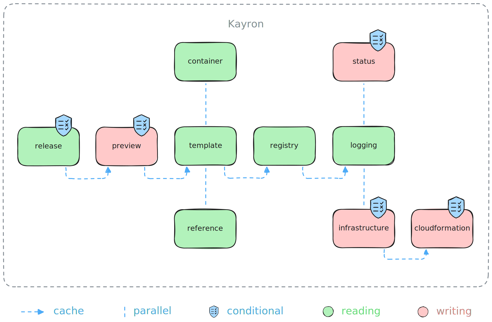

# kayron

This repository contains the operator responsible for our automated change
management. The relevant components here are described by the `server` and
`worker` packages. Kayron's sole responsibility is to keep our infrastructure
and services up to date, according to our release artifacts managed in Github.


### Server

The server is a simple HTTP backend exposing the Kayron's `/metrics` endopoint.

```
curl -s http://127.0.0.1:7777/metrics
```

```
# HELP go_gc_duration_seconds A summary of the wall-time pause (stop-the-world) duration in garbage collection cycles.
# TYPE go_gc_duration_seconds summary
go_gc_duration_seconds{quantile="0"} 0
go_gc_duration_seconds{quantile="0.25"} 0
go_gc_duration_seconds{quantile="0.5"} 0
```

### Worker

The worker is a custom task engine executing asynchronous worker handlers
iteratively. New worker handlers can be added easily by implementing the handler
interface and registering the handler in the worker engine.

```
type Interface interface {
	// Cooler is the amount of time that any given handler specifies to wait
	// before being executed again. This is not an interval on a strict schedule.
	// This is simply the time to sleep after execution, before another cycle
	// repeats.
	Cooler() time.Duration

	// Ensure executes the handler specific business logic in order to complete
	// the given task, if possible. Any error returned will be emitted using the
	// underlying logger interface. Calling this method will not interfere with
	// the execution of other handlers.
	Ensure() error
}
```

### Operator

Kayron is a change management controller implementing the [operator pattern], in
this particular case without the involvement of [Kubernetes]. The main goroutine
for the operator's reconciliation loop is the operator worker handler running a
sequence of steps according to their operator functions located in
`pkg/operator/`. Secondary worker handlers may be executed within their own
isolated failure domain.

Operators try to continuously drive the current state of a system towards the
desired state of a system. In our case, the current state is represented by the
already deployed CloudFormation templates in AWS. The desired state is then
represented by the template changes introduced in any given environment. Those
changes my simply be a version change from `v1.8.2` to `v1.8.3` in case of a
service update, or a more complex CloudFormation template change that modifies
physical resources in AWS. Kayron’s job is to continuously check for any
detectable drift between current and desired state, and apply any changes made
upon detection.

For instance, if a new Release were to be created in the
[Specta](https://github.com/0xSplits/specta) repository, then Kayron will
generate all CloudFormation templates anew using the changed resource details in
the underlying cache channels, and reconcile the resulting CloudFormation
templates against AWS, if the specified policies permit the proposed update.
This process will then eventually result in a stack update in CloudFormation, so
that Kayron may also keep the respective deployment status up to date in Github.



### Usage

At its core, Kayron is a simple [Cobra] command line tool, providing e.g. the
daemon command to start the long running `server` and `worker` processes.

```
kayron -h
```

```
Golang based operator microservice.

Usage:
  kayron [flags]
  kayron [command]

Available Commands:
  daemon      Execute Kayron's long running process for running the operator.
  deploy      Claim the given test environment and continuously deploy the given service branch.
  lint        Validate the release configuration under the given path.
  version     Print the version information for this command line tool.

Flags:
  -h, --help   help for kayron

Use "kayron [command] --help" for more information about a command.
```

### Development

Running the Kayron daemon requires the environment to be injected via
environment variable with one of these values: `development` `testing` `staging`
`production`. Any other value will cause an early runtime panic.

```
KAYRON_ENVIRONMENT=development KAYRON_GITHUB_TOKEN=todo kayron daemon
```

```
{ "time":"2025-07-04 14:09:06", "level":"info", "message":"daemon is launching procs", "environment":"development", "caller":".../pkg/daemon/daemon.go:38" }
{ "time":"2025-07-04 14:09:06", "level":"info", "message":"server is accepting calls", "address":"127.0.0.1:7777",  "caller":".../pkg/server/server.go:95" }
{ "time":"2025-07-04 14:09:06", "level":"info", "message":"worker is executing tasks", "pipelines":"1",             "caller":".../pkg/worker/worker.go:110" }
```

### Releases

In order to update the Docker image, prepare all desired changes within the
`main` branch and create a Github release for the desired Kayron version. The
release tag should be in [Semver Format]. Creating the Github release triggers
the responsible [Github Action] to build and push the Docker image to the
configured [Amazon ECR].

```
v0.1.11
```

The version command `kayron version` and the version endpoint `/version` provide
build specific version information about the build and runtime environment. A
live demo can be seen at https://kayron.testing.splits.org/version.

# Docker

Kayron's build artifact is a statically compiled binary running in a
[distroless] image for maximum security and minimum size. If you do not have Go
installed and just want to run Kayron locally in a Docker container, then use
the following commands.

```
docker build \
  --build-arg SHA="local-test-sha" \
  --build-arg TAG="local-test-tag" \
  -t kayron:local .
```

```
docker run \
  -e KAYRON_ENVIRONMENT=development \
  -p 7777:7777 \
  kayron:local \
  daemon
```

[Amazon ECR]: https://docs.aws.amazon.com/ecr
[Cobra]: https://github.com/spf13/cobra
[distroless]: https://github.com/GoogleContainerTools/distroless
[Github Action]: .github/workflows/docker-release.yaml
[operator pattern]: https://kubernetes.io/docs/concepts/extend-kubernetes/operator
[Kubernetes]: https://kubernetes.io/docs/concepts/overview
[Semver Format]: https://semver.org
